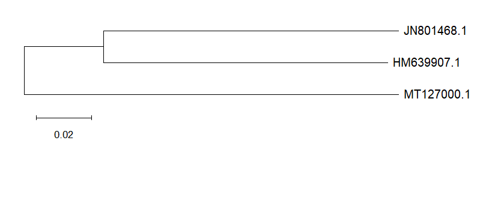

# My First Conservation Genomics Project

## What I Did
I downloaded DNA barcodes (COI gene) from NCBI and built a family tree using MEGA11.

## Animals Used
| Accession Number | Scientific Name | Common Name | Class |
|-----------------|-----------------|-------------|-------|
| HM639907.1 | *Pithecophaga jefferyi* | Philippine Eagle | Bird |
| JN801468.1 | *Tyto alba* | Barn Owl | Bird |
| MT127000.1 | *Dicerorhinus sumatrensis* | Sumatran Rhinoceros | Mammal |

## What the Tree Shows
The Philippine Eagle and Barn Owl are **closely related** (they share a recent branch point).  
The Sumatran Rhinoceros is **distantly related** (it branches off at the base).

This makes sense because:
- Eagles and owls are both **birds**
- Rhinos are **mammals**
- The DNA barcode correctly separated them by **class**

## Why This Matters for Conservation
The **Sumatran Rhinoceros** is critically endangered (&lt;80 individuals left).  
The **Philippine Eagle** is also critically endangered.  

By learning to read their DNA, we can:
1. Identify species from poop, hair, or blood samples
2. Track illegal wildlife trade (DNA barcoding)
3. Measure genetic health of small populations
4. Plan captive breeding to avoid inbreeding

## Tools Used
- NCBI (sequence download)
- MEGA11 (alignment + neighbor-joining tree)
- Notepad (file merging)

## Files
- `Sequence` — Combined DNA sequences
- `PhyloAnalysis` — Phylogenetic tree image
